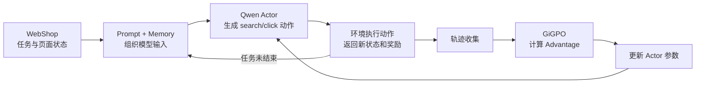

# 认识 verl-agent、WebShop 与 GiGPO

这一天主要解决了两个问题：为什么选择 `verl-agent + GiGPO + WebShop`，以及这个
项目到底是怎样运转起来的。

对第一次接触大模型强化学习的人来说，这个仓库很容易显得复杂：里面既有 Ray、
vLLM 和 FSDP，又有 PPO、GiGPO、环境交互和多轮 rollout。真正理清之后会发现，
它们并不是互相独立的一堆技术，而是在共同完成一件事：

> 让一个已经具备语言能力的模型，在环境中不断尝试、得到反馈，再根据反馈调整
> 自己的行为。

## 1. 为什么从 Search-R1 转向 GiGPO + WebShop

最初考虑的是 Search-R1。它的核心思路很有吸引力：模型不是直接回答问题，而是
可以主动搜索，根据检索结果继续推理，再用最终答案的正确性进行强化学习。

轻量版 Search-R1 也保留了不少关键机制，例如：

- 多轮搜索；
- 同一个问题采样多条轨迹；
- 使用组内相对 reward 计算 advantage；
- 检索结果属于环境 observation，不参与策略梯度；
- 最终通过策略梯度更新模型。

不过，轻量版和原版之间并不只是“模型小一点、显卡少一点”的区别。它通常还会
同时简化训练方式、检索系统、RL loss 和评测规模。比如原版使用全参数分布式训练
和固定检索库，而轻量版可能改成 LoRA、托管训练和实时搜索 API。

这意味着轻量版适合用来理解 Search-R1 的核心闭环，但不能直接等同于论文实验的
完整复现。

相比之下，`verl-agent` 的 WebShop 配置本身就是 1.5B 模型和两张 GPU，更符合
当前的算力条件。它还包含真正的多步 Agent—Environment 交互：

- 模型读取购物要求；
- 在页面中搜索商品；
- 点击商品或选项；
- 根据新页面继续决策；
- 最后购买符合条件的商品。

这里训练的不是单纯的问答能力，而是模型在一连串状态变化中选择动作的能力。
这也是最终选择 GiGPO + WebShop 的主要原因。

## 2. 先建立一个简单的整体模型

可以把整个系统想成一个正在练习网购的 Agent。

WebShop 给它一个任务，例如寻找满足品牌、颜色、价格等条件的商品。Qwen 模型
看到当前页面后输出一个动作，环境执行动作并返回新页面。这个过程会重复很多步，
直到模型完成购买，或者达到最大交互步数。

一条完整过程就是一个 episode，也可以叫 trajectory：

```text
接收购物任务
→ 搜索关键词
→ 查看搜索结果
→ 点击商品
→ 选择规格
→ 点击购买
→ 得到最终结果
```

训练时不会只让模型尝试一次，而是会对同一个任务采样多条轨迹。这样才能比较：

> 面对同样的任务，哪些行为序列更好，哪些步骤更值得保留？

整个闭环可以概括为：



对应到强化学习术语：

| 术语 | 在这个项目中的含义 |
|---|---|
| Agent / Policy / Actor | 正在训练的 Qwen 模型 |
| Environment | WebShop 文本购物环境 |
| Observation | 当前任务、页面内容、可用动作和最近历史 |
| Action | 模型输出的 `search[...]` 或 `click[...]` |
| Reward | 环境对交互结果给出的训练信号 |
| Episode / Trajectory | 从任务开始到结束的一整段交互 |
| Rollout | 使用当前模型实际生成一批交互轨迹 |
| Advantage | 某次尝试或某个动作相对其他尝试好多少 |
| Policy Update | 根据 advantage 调整模型参数 |

## 3. 仓库里的几层代码分别负责什么

### 3.1 `examples/`：告诉系统这次实验要怎么跑

当前最重要的入口是：

```text
examples/gigpo_trainer/run_webshop.sh
```

它更像一张实验配方，里面写着：

- 使用哪个模型；
- 使用哪种 advantage estimator；
- 一个 batch 有多少任务；
- 每个任务采样多少条轨迹；
- 一条轨迹最多走多少步；
- 学习率、KL 和无效动作惩罚是多少；
- 使用几张 GPU；
- 多久验证一次。

所以想知道“一次实验到底运行了什么”，最先应该看的通常是启动脚本。

### 3.2 `verl/`：通用强化学习训练引擎

`verl/` 是整个项目的发动机，负责把模型加载、分布式调度、采样和参数更新组织
起来。

其中两个入口最关键：

- `verl/trainer/main_ppo.py`：读取配置，创建模型、环境、worker 和训练器；
- `verl/trainer/ppo/ray_trainer.py`：执行采样、奖励处理、advantage 计算、
  Actor 更新、验证和 checkpoint 流程。

项目中还会频繁看到 `DataProto`。它可以先理解成强化学习训练管线里的统一数据
容器：既能放模型 tensor，也能放轨迹 ID、环境 reward、动作是否合法等普通
Python 信息。

### 3.3 `agent_system/`：让模型真正和环境交互

普通语言模型训练通常只处理固定的输入和输出，而 Agent 训练需要在生成过程中
不断调用环境。`agent_system/` 就是负责这层交互的。

几个关键文件分别是：

- `agent_system/multi_turn_rollout/rollout_loop.py`：控制模型与环境的多轮循环；
- `agent_system/environments/env_manager.py`：把页面、历史和可用动作整理成
  下一轮 prompt；
- `agent_system/environments/env_package/webshop/envs.py`：封装 WebShop 环境；
- `agent_system/memory/memory.py`：保存并截取最近的交互历史；
- `agent_system/reward_manager/episode.py`：把 episode reward 放回模型输出
  对应的 token 位置。

`verl-agent` 相比普通 veRL，最明显的扩展就发生在这一层。

### 3.4 `gigpo/`：计算更细粒度的 Advantage

GiGPO 的主要实现位于：

```text
gigpo/core_gigpo.py
```

它不只比较整条轨迹的最终表现，还会进一步比较轨迹内部的步骤。这部分正是
GiGPO 和普通组相对方法之间最值得关注的区别。

## 4. 一轮 WebShop 训练是怎样发生的

### 4.1 Hydra 先组合出最终配置

这个项目使用 Hydra 管理配置。一次实验的最终参数来自：

```text
ppo_trainer.yaml 中的默认值
+ run_webshop.sh 中的覆盖值
+ 启动时额外传入的参数
= 最终配置
```

所以只看 YAML 或 shell 脚本中的某一处都可能不完整。真正排查实验时，应以程序
启动后打印出来的 resolved config 为准。

### 4.2 DataLoader 提供的是“外壳”，不是购物任务

`examples/data_preprocess/prepare.py` 会下载 Geometry3K。看到这里很容易产生疑问：
为什么训练购物 Agent，要下载一个几何数据集？

实际上，WebShop 并不使用 Geometry3K 的数学题。文本模式下生成的 prompt 基本
是空字符串，这份 parquet 主要用于让通用 veRL 训练管线知道：

- 当前是文本模态；
- 一个 batch 有多少项；
- DataLoader 要迭代多少次。

真正的购物任务来自 WebShop 环境的 `reset()`。

可以把二者的关系理解为：

```text
DataLoader：提供训练循环所需的 batch 外壳
WebShop reset()：提供 Agent 实际要完成的任务
```

这是理解这个项目数据流时最容易卡住的地方之一。

### 4.3 同一个任务会被复制成一组轨迹

官方 WebShop 脚本使用：

```text
train_data_size = 16
env.rollout.n = 8
```

也就是说，一轮会取 16 个购物任务，每个任务采样 8 次，最多形成 128 条轨迹。

同组的 8 个环境从同一个购物任务开始，但模型采样出的动作可能不同。有的轨迹
可能很快找到正确商品，有的可能反复点击错误选项，还有的可能一直产生无效动作。
有了这些差异，算法才能计算组内相对 advantage。

这里使用的是 `env.rollout.n`。`main_ppo.py` 明确要求原生 veRL 的
`actor_rollout_ref.rollout.n` 保持为 1，因为轨迹分组已经交给环境层处理了。

### 4.4 模型和环境逐步交互

每一步大致会经历：

```text
读取当前页面和任务
→ 拼接最近的交互历史
→ 加入当前允许的动作
→ tokenizer
→ vLLM 生成动作
→ 解析 search[...] / click[...]
→ WebShop 执行动作
→ 返回 observation、reward、done 和 info
```

如果任务已经结束，环境会返回 `done=True`；否则模型继续进行下一步。官方脚本
设置 `env.max_steps=15`，所以一条轨迹最多交互 15 步。

### 4.5 Memory 不会无限保存全部历史

基础配置中的：

```yaml
env:
  history_length: 2
```

表示构造下一轮输入时，通常只带最近两步交互，而不是把整条轨迹全部塞进上下文。

这样做有两个作用：

- 控制 prompt 长度，避免多轮交互不断膨胀；
- 让每一步都根据当前状态和有限历史重新决策。

这也是项目所说的 step-independent multi-turn rollout 的直观含义。

## 5. WebShop 里的 Reward 要分开看

WebShop 原始环境会给出一个 0 到 1 的连续任务分数，用来衡量最终商品与用户要求
的匹配程度。

但 `agent_system/environments/env_package/webshop/envs.py` 又对训练 reward 做了
重新定义：

- 原始分数保存在 `info["task_score"]` 中；
- episode 结束且原始 reward 等于 1.0，训练 reward 才设为 10.0；
- 其他情况的训练 reward 都设为 0；
- Actor 更新时还启用了系数为 0.1 的 invalid-action penalty。

因此日志里的几个量含义不同：

| 指标 | 含义 |
|---|---|
| `success_rate` | 是否完全完成任务 |
| `webshop_task_score` | 商品与要求的连续匹配程度 |
| 训练 reward | 当前 wrapper 使用的 10/0 结果信号 |
| invalid-action penalty | 对不合法动作额外加入的优化惩罚 |

比如，一个轨迹可能选到了比较接近要求的商品，因此 `task_score` 不低，但只要没有
完全满足条件，它仍然不算成功，训练 reward 也可能是 0。

这说明看训练曲线时不能只盯着一个“reward”，而要先确认这个指标具体来自哪里。

## 6. GiGPO 到底比 GRPO 多做了什么

先从普通的组相对思想说起。

面对同一个任务，模型会采样多条轨迹。假设其中一些成功，一些失败，就可以把每条
轨迹的结果与组内平均水平比较：

```text
表现高于组内平均 → 正 advantage
表现低于组内平均 → 负 advantage
```

这种 episode-level 信号能告诉模型哪条完整轨迹更好，但有一个局限：一条轨迹里
可能前几步做得很好，只在最后一步犯错；也可能前面乱走，最后碰巧成功。如果只看
最终结果，很难判断中间的每一步究竟贡献了什么。

GiGPO 在此基础上增加了 step-level advantage。当前实现可以概括为：

```text
最终 Advantage
= Episode 相对 Advantage
+ step_advantage_w × Step 相对 Advantage
```

其中：

- Episode advantage 比较同一任务下不同完整轨迹的结果；
- Step advantage 把相同或相似的中间 observation 分到一组，再比较不同动作的
  后续折扣回报；
- `step_advantage_w` 控制步骤级信号所占的权重。

举个简化例子：两条轨迹都来到同一个商品详情页。

- 轨迹 A 点击了正确规格，最后成功购买；
- 轨迹 B 点击了错误规格，最后失败。

只看 episode reward，可以知道 A 整体比 B 好。加入 step-level 分组后，还能更
直接地把差异归因到“在这个商品详情页选择了哪个动作”。

这就是 credit assignment：不仅知道结果好不好，还尽量判断是哪一步促成了结果。

代码中还使用 `gamma=0.95` 计算折扣回报。越靠后的奖励会向前传播，但距离最终
结果越远，影响会按 `gamma` 逐步衰减。

## 7. PPO-style 更新、KL 与无效动作惩罚

GiGPO 负责产生 advantage，真正更新模型时仍然使用 PPO 风格的目标。

可以先用直觉理解：

- advantage 为正的动作，应该提高它的生成概率；
- advantage 为负的动作，应该降低它的生成概率；
- PPO clipping 限制单次更新幅度，避免策略变化过猛；
- KL loss 限制新策略过快偏离原始 Qwen；
- entropy 相关指标用于观察策略是否还保留一定探索性；
- invalid-action penalty 专门压低不符合 WebShop 动作格式或当前页面约束的输出。

这里要区分两件事：

```text
GiGPO：告诉训练器哪些动作相对更好，也就是怎样计算 advantage
PPO-style objective：告诉训练器怎样利用 advantage 更新模型
```

它们处在训练流程的不同位置，不是两个互相替代的完整训练系统。

## 8. Ray、vLLM 和 FSDP 是怎样配合的

这些组件第一次看很容易混在一起，可以按职责拆开：

| 组件 | 主要职责 |
|---|---|
| Hydra | 组合并管理实验配置 |
| Ray | 调度模型 worker 和多个 WebShop 环境进程 |
| vLLM | 加速 Actor 的 rollout 生成 |
| FSDP | 在多张 GPU 上分片训练状态和计算 |
| Reference Policy | 提供参考 log probability，用于 KL 约束 |
| W&B | 记录训练、验证和系统指标 |

训练过程大致分为两个阶段：

1. rollout 阶段主要关心怎样快速生成大量动作，因此使用 vLLM；
2. update 阶段需要计算梯度并更新参数，因此使用 FSDP。

这不意味着显存中始终放着两套完全独立的 Actor。项目使用 hybrid engine，让同一
组 GPU 在推理和训练阶段之间切换与复用资源。

Ray 则站在更外层：它既要管理模型 worker，也要管理大量并行的 WebShop 环境。
所以这个项目的资源压力不只来自模型显存，还包括环境进程使用的 CPU 和主机内存。

## 9. 用官方脚本把知识串起来

`examples/gigpo_trainer/run_webshop.sh` 中的主要配置是：

| 配置 | 当前值 |
|---|---:|
| 模型 | `Qwen/Qwen2.5-1.5B-Instruct` |
| GPU 数量 | 2 |
| 训练任务数 | 16 |
| 验证 batch | 128 |
| 每任务轨迹数 | 8 |
| 最大交互步数 | 15 |
| Prompt 最大长度 | 4096 |
| 单步 response 最大长度 | 512 |
| 学习率 | `1e-6` |
| KL loss 系数 | `0.01` |
| invalid-action penalty 系数 | `0.1` |
| 折扣因子 gamma | `0.95` |
| Step advantage 权重 | `1.0` |
| vLLM tensor parallel size | 2 |
| vLLM 显存利用率 | `0.6` |
| 验证频率 | 每 5 个训练 step |
| 总 epoch | 150 |

把这些参数放回前面的流程，就能看出它们分别控制什么：

- `train_data_size=16` 决定一轮有多少个不同任务；
- `env.rollout.n=8` 决定每个任务有多少条组内轨迹；
- `env.max_steps=15` 限制一条轨迹的最长交互；
- `gamma=0.95` 控制未来奖励向前传播时的衰减；
- `step_advantage_w=1.0` 控制 GiGPO 中步骤级 advantage 的权重；
- `kl_loss_coef=0.01` 控制新策略偏离参考策略的代价；
- `invalid_action_penalty_coef=0.1` 控制无效动作的额外惩罚；
- `tensor_model_parallel_size=2` 表示 rollout 模型跨两张 GPU 做张量并行。

这样再看启动脚本时，它就不再是一长串孤立参数，而是一张完整训练流程的配置图。

## 10. 这一天真正理解到的几个关键点

第一，Agent RL 与普通问答训练最大的不同，是数据在训练过程中由模型和环境共同
产生。模型每一步的输出会改变下一步输入。

第二，WebShop 的 parquet 数据不是实际购物任务。真正的任务由环境 `reset()`
提供，DataLoader 只是为通用训练框架提供 batch 外壳。

第三，group size 的意义不是简单把 batch 放大，而是让模型对同一个任务进行多次
尝试，从而构造相对比较信号。

第四，GiGPO 的重点不只是“使用最终奖励”，而是把整条轨迹和中间步骤两个层次的
credit assignment 结合起来。

第五，日志中的 success rate、task score、训练 reward 和 invalid-action penalty
不是同一个量。分析实验前，必须先追清楚指标的定义和代码来源。

第六，vLLM、FSDP 和 Ray 分别处理生成效率、分布式训练和任务调度。理解它们在
流程中的位置，比一开始深入它们的底层实现更重要。
