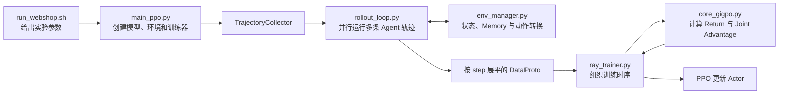
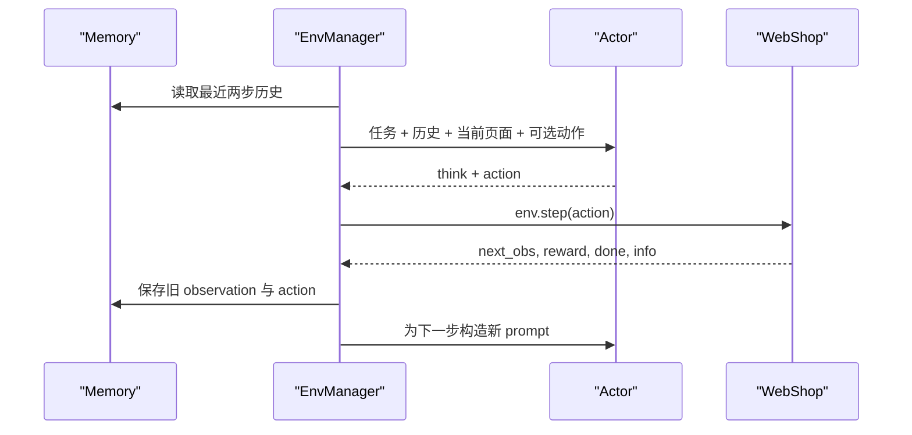

# verl-agent 核心代码阅读

这次阅读的目标不是逐行翻译代码，而是顺着一次 WebShop 训练真正发生的顺序，
弄清楚几个核心文件各自接过了哪一棒。

整条主线围绕六个核心文件展开：

1. `run_webshop.sh`：描述这次实验打算怎么跑；
2. `main_ppo.py`：把模型、环境、worker 和训练器组装起来；
3. `rollout_loop.py`：让 Actor 与 WebShop 反复交互，收集完整轨迹。
4. `env_manager.py`：把环境状态、memory 和可选动作组织成 prompt；
5. `core_gigpo.py`：计算 episode 与 step 两层 advantage；
6. `ray_trainer.py`：把采样、reward、log-prob 和 Actor 更新串成完整训练循环。

WebShop 的规则奖励和 token reward 还会涉及 `goal.py`、`envs.py` 与
`episode.py`。它们不是最外层入口，但正好解释了几个关键疑问。

把这三部分连起来后，代码主线是：



这里最重要的认识是：`verl-agent` 的训练样本不是一次普通的文本 completion，而是
模型在环境中完成的一条多步交互轨迹。轨迹采集完成后，代码又会把它拆成许多
step 样本，交给后面的 GiGPO 和 PPO 训练流程。

## 1. `run_webshop.sh`：先看懂这次实验

文件位置：

[examples/gigpo_trainer/run_webshop.sh](../../origin-code/examples/gigpo_trainer/run_webshop.sh)

这个脚本可以理解为实验配方。它并不实现 GiGPO 的数学公式，也不负责环境交互，
而是告诉训练程序：

- 使用什么模型；
- 每轮采多少任务；
- 同一个任务生成多少条轨迹；
- 一条轨迹最多交互多少步；
- rollout、Actor 和 Reference 分别怎样使用 GPU；
- 学习率、KL 和非法动作惩罚是多少；
- 多久验证一次，一共训练多少轮。

### 1.1 三个最先要看的规模参数

```bash
train_data_size=16
group_size=8
env.max_steps=15
```

它们分别表示：

| 参数 | 含义 |
|---|---|
| `train_data_size=16` | 一个训练 iteration 取 16 个不同的购物任务 |
| `group_size=8` | 每个任务并行采样 8 条完整轨迹 |
| `env.max_steps=15` | 每条轨迹最多执行 15 个 Agent action |

所以一次 iteration 最多会经历：

```text
16 tasks × 8 trajectories × 15 steps = 1920 step samples
```

这个 1920 只是上限。某条轨迹如果提前成功购买，或者提前结束，就不会真的走满
15 步。

### 1.2 模型在这里承担哪些角色

脚本使用：

```text
Qwen/Qwen2.5-1.5B-Instruct
```

同一个基础模型在训练系统中会出现几个不同角色：

- Actor：正在被优化的策略模型；
- Rollout model：使用当前 Actor 参数生成动作；
- Reference policy：冻结的参考策略，用于计算 KL；
- Critic：本次 GiGPO 配置不使用。

Actor 与 rollout 并不是两个毫无关系的模型。项目使用 hybrid engine，在采样阶段
利用 vLLM 生成，在更新阶段切换到训练 Actor 的计算路径。

Reference policy 不参与环境采样，也不会更新参数。它只回答一个问题：

> 当前 Actor 已经偏离初始 Qwen 多远？

### 1.3 `env.rollout.n` 才是这里的 group size

脚本设置：

```bash
env.rollout.n=8
```

与此同时，原生 veRL 配置里的：

```text
actor_rollout_ref.rollout.n
```

仍然保持为 1。

这两个参数看起来很像，但含义不同：

```text
普通 veRL：
一个 prompt 一次生成 n 个文本 completion

verl-agent：
一个环境任务复制为 n 个独立环境，
每个环境各自运行一条多步 Agent 轨迹
```

也就是说，这里的 8 路采样不是“同一个 prompt 直接生成 8 个答案”，而是“面对
同一个购物目标，让 8 个环境实例各自走完搜索、点击和购买过程”。

这个区别决定了后面 GiGPO 比较的对象是完整环境轨迹，而不是普通单轮回答。

### 1.4 与 GiGPO 直接有关的几个参数

```bash
algorithm.adv_estimator=gigpo
algorithm.gamma=0.95
algorithm.gigpo.step_advantage_w=1.0
algorithm.gigpo.mode=mean_norm
```

可以先做直观理解：

- `adv_estimator=gigpo`：使用 GiGPO 计算 advantage；
- `gamma=0.95`：越早的动作距离最终结果越远，回传信号会有所衰减；
- `step_advantage_w=1.0`：episode advantage 与 step advantage 等权相加；
- `mean_norm`：组内 advantage 只减均值，不再除以标准差。

具体公式会在后面的 `core_gigpo.py` 中出现。此时只需要知道，启动脚本已经决定了
算法采用哪一种计算方式。

### 1.5 KL 的两个开关不要混在一起

脚本中同时出现：

```bash
actor_rollout_ref.actor.use_kl_loss=True
algorithm.use_kl_in_reward=False
```

它们表达的是两件事：

- `use_kl_in_reward=False`：KL 不直接修改环境 reward；
- `use_kl_loss=True`：KL 作为 Actor loss 中的正则项。

所以本次实验的 reward 仍来自 WebShop 环境，而不是“环境 reward 再减去 KL”。
Actor 更新时才额外受到 reference KL 的约束。

### 1.6 启动脚本不是最终配置的全部

这个项目使用 Hydra。最终配置由三层叠加：

```text
ppo_trainer.yaml 默认值
+ run_webshop.sh 中的覆盖值
+ 启动脚本末尾传入的额外参数
= 本次运行的 resolved config
```

例如 `history_length=2` 并没有在 `run_webshop.sh` 中显式出现，而是来自默认配置。

因此阅读或复现实验时，不能只看 shell 脚本。真正可靠的是程序启动后打印出的完整
resolved config。

## 2. `main_ppo.py`：它负责组装，不负责算 PPO

文件位置：

[verl/trainer/main_ppo.py](../../origin-code/verl/trainer/main_ppo.py)

这个文件名字里有 PPO，但它本身不实现 PPO loss。它更像系统的装配入口，负责把
配置中的各个角色变成真正可以工作的对象。

调用关系可以简化为：

```text
main()
→ run_ppo()
→ 创建远程 TaskRunner
→ TaskRunner.run()
→ 创建 RayPPOTrainer
→ trainer.init_workers()
→ trainer.fit()
```

### 2.1 为什么要先创建 Ray

这个项目不只需要一个模型进程，还要同时管理：

- Actor/rollout worker；
- Reference policy worker；
- 多个 WebShop 环境 worker；
- 训练与验证所需的资源池。

Ray 负责把这些角色调度起来。`main_ppo.py` 并不亲自执行每个 WebShop step，而是
先建立资源和角色之间的映射。

### 2.2 根据分布式策略选择 worker

代码会根据配置选择 FSDP 或 Megatron worker。当前 WebShop 脚本使用 FSDP，因此
Actor、rollout 和 reference 都走相应的 FSDP worker 实现。

这里可以把 FSDP 先理解成：

> 让两张 GPU 协作保存和训练模型参数，而不是让每张卡各自独立训练一份模型。

更底层的参数分片和通信不是此时阅读的重点。对主流程来说，只需要知道
`main_ppo.py` 会根据配置把正确的 worker 类注入训练器。

### 2.3 GiGPO 为什么不创建 Critic

传统 PPO 经常使用一个 Critic 估计状态价值：

```text
A_t ≈ R_t - V(s_t)
```

GiGPO 使用组内相对比较来构造 advantage，不依赖单独训练的 value model。因此
本次配置不会创建 Critic。

但 Reference policy 仍然存在，因为脚本启用了：

```text
actor.use_kl_loss=True
```

所以要分清：

```text
Critic：用于估计 value，本次不需要
Reference：用于计算 KL，本次需要
```

### 2.4 `EpisodeRewardManager` 不是奖励模型

`main_ppo.py` 会选择 `EpisodeRewardManager`。这个名字容易让人误以为系统创建了
一个神经网络 reward model，其实不是。

它的作用是把环境已经计算好的 episode reward 整理成训练器需要的 token tensor。
至于 WebShop 最终怎样判断商品是否符合要求，是环境内部的规则逻辑，后面阅读
reward 路径时再展开。

### 2.5 最关键的一条断言

`main_ppo.py` 中有一条非常关键的检查：

```python
assert config.actor_rollout_ref.rollout.n == 1
```

它说明 `verl-agent` 有意把 group sampling 从原生文本 rollout 层挪到了环境层：

```text
actor_rollout_ref.rollout.n = 1
env.rollout.n = 8
```

这不是参数写法上的偶然差异，而是整个数据建模方式发生了变化。

普通文本 RL 中，一个 batch 行通常对应一个 prompt-response；在这里，一条完整
轨迹会包含多个 prompt-response step，后面还要按环境状态重新分组。

### 2.6 `TrajectoryCollector` 是装配层与交互层的接口

完成模型和环境创建后，`main_ppo.py` 会构造：

```text
TrajectoryCollector
```

训练器不需要知道 WebShop 每一页怎样组织，也不需要自己维护 128 个环境的状态。
它只需要向 `TrajectoryCollector` 请求一批轨迹。

因此两个文件的职责边界很清楚：

```text
main_ppo.py：
决定“谁参与训练，以及各自使用什么资源”

TrajectoryCollector / rollout_loop.py：
决定“这些角色怎样进行一次多轮环境采样”
```

## 3. `rollout_loop.py`：一条 Agent 轨迹怎样产生

文件位置：

[agent_system/multi_turn_rollout/rollout_loop.py](../../origin-code/agent_system/multi_turn_rollout/rollout_loop.py)

这里开始进入真正的 Agent—Environment 循环。

主入口是 `multi_turn_loop()`，内部再调用 `vanilla_multi_turn_loop()`。训练时，
它先把任务复制成 group，然后让模型和 WebShop 最多交互 15 步。

### 3.1 16 个任务怎样变成 128 条轨迹

训练 batch 最初有 16 行。代码执行类似：

```python
gen_batch.repeat(repeat_times=8, interleave=True)
```

得到的排列大致为：

```text
task_0, trajectory_0
task_0, trajectory_1
...
task_0, trajectory_7
task_1, trajectory_0
...
```

WebShop 底层也会把同一个购物 goal 复制 8 次。因此这 8 个环境确实面对同一个
任务，只是采样出的 action 可能不同。

这种排列让后面的 episode group 很自然：连续的 8 条轨迹属于同一个任务。

### 3.2 一次环境 step 的实际顺序

每个活跃环境都会反复经历：

```text
取得当前 observation
→ EnvManager 构造 prompt
→ tokenizer
→ vLLM 生成 response
→ decode 为文本
→ 提取 <action> 中的动作
→ env.step(action)
→ 收集 next_obs、reward、done、info
→ 保存这一条 step 数据
```

模型输出通常包含两部分：

```text
<think>先搜索防水红色徒步鞋</think>
<action>search[red waterproof hiking shoes]</action>
```

真正传给 WebShop 的只是 `<action>` 标签中的：

```text
search[red waterproof hiking shoes]
```

如果所有环境都已经结束，循环会提前退出；否则最多执行 `env.max_steps=15`。

### 3.3 每个 step 都是一次独立的模型生成

一条五步 WebShop 轨迹，不是 Actor 一次 forward 连续生成五个动作。

它实际调用模型五次：

```text
prompt_1 → response_1 → env.step
prompt_2 → response_2 → env.step
prompt_3 → response_3 → env.step
prompt_4 → response_4 → env.step
prompt_5 → response_5 → env.step
```

下一步的 prompt 会包含新的页面状态，以及环境管理器放进去的历史信息。

因此 Agent RL 的数据不是预先固定的。第 `t` 步生成的 action 会改变环境，
环境返回的结果又会决定第 `t+1` 步的输入。

### 3.4 三个 ID 分别解决什么问题

轨迹收集过程中最值得记住的是：

| 字段 | 作用 |
|---|---|
| `uid` | 标识原始购物任务；同一任务的 8 条轨迹共享 |
| `traj_uid` | 标识某一条具体轨迹 |
| `anchor_obs` | 保存当前不含历史的环境状态，用于 step-level 分组 |

它们对应三种不同的问题：

```text
uid：
哪些轨迹在解决同一个任务？

traj_uid：
哪些 step 属于同一条轨迹，时间顺序是什么？

anchor_obs：
不同轨迹中的哪些 action 是从相同环境状态出发的？
```

后面计算 GiGPO 时：

- Episode advantage 使用 `uid` 比较同一任务的多条轨迹；
- discounted return 使用 `traj_uid` 恢复一条轨迹的时间顺序；
- Step advantage 使用 `uid + anchor_obs` 比较相同任务、相同状态下的动作。

如果这三个字段混在一起，GiGPO 的代码会很难理解。

### 3.5 一条 step 样本里有什么

一次 action 生成结束后，收集的数据大致包括：

```text
prompts
responses
input_ids
attention_mask
position_ids
uid
traj_uid
anchor_obs
rewards
active_masks
is_action_valid
```

这里的一行不是一个 token，而是一次完整的：

```text
当前状态下的 prompt + Actor 生成的 response
```

每行内部可能包含很长的 prompt token 和最多 512 个 response token。

### 3.6 为什么最后要把轨迹展平成 step batch

假设 128 条轨迹的实际长度分别为：

```text
L_1, L_2, …, L_128
```

轨迹采集完成后的训练行数是：

```text
N = L_1 + L_2 + … + L_128
```

不是固定的 128。

例如：

```text
trajectory A：4 个 step
trajectory B：7 个 step
trajectory C：15 个 step
```

展平后就得到：

```text
A_step_1
A_step_2
A_step_3
A_step_4
B_step_1
...
C_step_15
```

这样做的原因是，PPO 最终要优化的是每一次模型生成的 response token。虽然 reward
来自整条轨迹，但真正被更新的 action 是逐 step 产生的。

已经结束的环境可能因为并行执行仍短暂占据位置，`active_masks` 会标记这些无效
占位行。收集结束后，代码只保留真实发生过的 action step。

## 4. 这一段代码链路最容易混淆的几个问题

### 4.1 “每个任务采样 8 次”到底采样的是什么？

采样的是 8 条完整环境轨迹，不是 8 个普通回答。

每条轨迹内部还会多次调用 Actor，所以：

```text
一个 task
→ 8 条 trajectory
→ 每条 trajectory 有若干 step
→ 每个 step 有一个 prompt-response
```

这是整个项目的数据层级。

### 4.2 一条轨迹是不是一个训练样本？

从环境角度看，一条轨迹是一个完整样本；从 Actor 更新角度看，它又会被拆成多个
step 行。

更准确的说法是：

```text
环境采样单位：trajectory
GiGPO 分组单位：trajectory 与 state-conditioned step
PPO 计算单位：step response 中的 token
```

### 4.3 为什么 `main_ppo.py` 不直接写训练循环？

因为它负责的是组件装配。真正的多轮采样在 `rollout_loop.py`，完整的 PPO 训练
时序则在 `ray_trainer.py`。

把职责分开后：

- 环境可以替换为 ALFWorld、Sokoban 或其他任务；
- 分布式策略可以替换；
- advantage estimator 可以替换；
- 主入口仍然只需要根据配置选择并连接组件。

### 4.4 Actor 在同一步生成时能看到环境结果吗？

不能。

第 `t` 次生成时，Actor 只能看到执行 action 之前的当前 observation 和已有
历史。它生成 action 后，WebShop 才执行 `env.step()`。

执行结果会进入第 `t+1` 次 prompt：

```text
第 t 次 forward：
读取 o_t 和过去历史 → 生成 a_t

环境：
执行 a_t → 返回 o_{t+1}, r_t, done_t

第 t+1 次 forward：
读取 o_{t+1} 和更新后的历史 → 生成 a_{t+1}
```

Actor 不是通过神经网络 hidden state 跨环境 step 记忆，而是依靠环境管理器把历史
重新写进下一轮 prompt。这部分具体怎样实现，会在 `env_manager.py` 的阅读中
展开。

## 5. 用一句话复述这一段

`run_webshop.sh` 先规定“16 个任务、每题 8 条轨迹、每条最多 15 步”的实验；
`main_ppo.py` 再用 Ray 把 Actor、Reference、WebShop 环境和训练器装配起来；
`rollout_loop.py` 最后真正运行 128 条并行 Agent 轨迹，并把每次环境动作整理成
按 step 展平的训练 batch。

到这里得到的还只是“模型做了什么、环境返回了什么”。这些 step 怎样携带 memory，
WebShop 怎样计算 reward，以及 reward 怎样变成 GiGPO advantage，属于后续代码
链路。

## 6. `env_manager.py`：把环境状态变成模型能读的 Prompt

文件位置：

[agent_system/environments/env_manager.py](../../origin-code/agent_system/environments/env_manager.py)

`rollout_loop.py` 负责控制循环，但它不会亲自处理 WebShop 页面。页面怎样清洗、
历史怎样加入 prompt、模型输出怎样变成环境动作，主要由
`WebshopEnvironmentManager` 完成。

一次环境 step 可以展开成：



### 6.1 `reset()` 不只是返回一个页面

WebShop 环境 reset 后会返回原始页面文本和 `info`。环境管理器接着做几件事：

1. 从原始 observation 中提取购物任务；
2. 去掉页面里重复出现的任务描述；
3. 把任务、当前页面和可用动作拼成第一轮 prompt；
4. 保存一份不含历史的 `anchor_obs`；
5. 清空上一条轨迹留下的 memory。

为什么要单独保存 `anchor_obs`？

因为真正发给 Actor 的 prompt 可能包含历史，而 GiGPO 想比较的是“当前环境状态
是否相同”。如果直接用完整 prompt 分组，即使两条轨迹来到同一个商品页，只要
它们之前的历史不同，文本就不会完全一致。

所以代码有意区分：

```text
Actor prompt：
任务 + 历史 + 当前页面 + 可选动作

anchor_obs：
不含历史的当前环境状态
```

前者用于决策，后者用于 step group。

### 6.2 Actor 到底能不能看到 Memory？

这是阅读时一个很自然的疑问：

> Memory 明明保存在环境管理器中，Actor 做 forward 时怎么能看到它？

答案是：Actor 看不到 `SimpleMemory` 这个 Python 对象，但能看到环境管理器把
memory 序列化后写进 prompt 的文本。

每一步结束后，环境管理器保存：

```python
self.memory.store({
    "text_obs": self.pre_text_obs,
    "action": actions,
})
```

下一步构造 prompt 时，再读取最近两步：

```text
Observation 1: ...
Action 1: search[...]

Observation 2: ...
Action 2: click[...]
```

然后把这些文本和新页面一起交给 Actor。

因此第 `t` 次生成时，Actor 能看到的是：

```text
a_t ~ π_θ(action | task, serialized_history_(t-2:t-1), o_t)
```

这里不是 RNN 式的隐藏状态，也不是 vLLM 一直保留着一个对话 session。每个
WebShop step 都会重新构造 prompt、tokenize，再调用一次模型。

可以把它叫作：

> 外部 memory + 无状态 policy。

第一步没有历史；第二步开始，prompt 才会出现第一步的 observation 和 action。

### 6.3 当前 Action 的执行结果要到下一次 Forward 才能看到

Actor 在生成当前 action 时，当然还不知道这个动作执行后会出现什么页面。

时间顺序是：

```text
第 t 次 forward：
读取 o_t 与已有历史
→ 生成 a_t

WebShop：
执行 a_t
→ 返回 o_(t+1)、r_t、done_t

第 t+1 次 forward：
读取 o_(t+1) 与更新后的历史
→ 生成 a_(t+1)
```

所以 Actor 能利用过去的环境反馈，但不能在同一次 forward 中提前看到未来结果。

### 6.4 Prompt 里实际包含什么

WebShop prompt 大致由以下部分组成：

- 原始购物目标；
- 最近两步 observation/action；
- 当前页面内容；
- 当前可用的 action；
- 输出格式要求。

模型被要求生成：

```text
<think>...</think>
<action>...</action>
```

默认 `history_length=2`，不是把整条轨迹无限加入 prompt。如果加入历史后字符数
超过代码设置的阈值，环境管理器会退回不含历史的模板，避免输入持续膨胀。

这意味着 memory 并不等于“模型知道整条过去”。它只是一种受长度限制的外部上下文
策略。

### 6.5 模型输出怎样变成 WebShop 动作

假设 Actor 输出：

```text
<think>先搜索红色防水徒步鞋</think>
<action>search[red waterproof hiking shoes]</action>
```

`webshop_projection()` 会从 `<action>` 标签中提取：

```text
search[red waterproof hiking shoes]
```

再把它交给底层 `env.step()`。

代码还会产生 `is_action_valid`，但这里主要检查的是输出格式，例如：

- 是否同时存在 `<think>` 与 `<action>`；
- 标签能否正确解析；
- 输出中是否出现不允许的中文内容。

它并没有严格验证模型选择的动作一定属于当前页面给出的 `available_actions`。
所以“格式合法”和“环境中真的可执行”不是完全相同的概念。

## 7. WebShop 怎样记录一次购物过程

环境封装位置：

[agent_system/environments/env_package/webshop/envs.py](../../origin-code/agent_system/environments/env_package/webshop/envs.py)

WebShop 文本环境位置：

[web_agent_text_env.py](../../origin-code/agent_system/environments/env_package/webshop/webshop/web_agent_site/envs/web_agent_text_env.py)

模型每次只输出一个文本 action，但环境内部需要维护一段连续的购物状态。这个状态
主要保存在 session 中。

### 7.1 Search 之后记录了什么

假设第一个动作是：

```text
search[red waterproof hiking shoes]
```

环境会记录类似信息：

```python
session["keywords"] = [
    "red",
    "waterproof",
    "hiking",
    "shoes",
]
session["page"] = 1
session["asin"] = None
session["options"] = {}
session["actions"]["search"] += 1
```

搜索引擎根据关键词返回商品列表，新的搜索结果页成为下一步 observation。

环境状态可以分成三层：

```text
WebShop session：
搜索词、页码、当前商品 ASIN、已选颜色/尺寸、浏览记录

浏览器/页面状态：
当前页面 HTML、URL、可点击元素

Agent 外部 memory：
最近的 observation 与 action 文本
```

WebShop session 负责业务状态，外部 memory 负责给 Actor 提供有限历史。两者不是
同一个东西。

### 7.2 Search 和普通 Click 不会立即得到匹配分

环境每次接收 action 时，会先初始化：

```text
reward = 0
done = False
```

下面这些动作都不会立即计算商品匹配度：

```text
search[...]
点击搜索结果
打开商品页
选择颜色或尺寸
翻页
查看描述
```

它们只会改变 session 和当前页面。

只有点击 `Buy Now` 时，环境才结束 episode，并调用商品匹配规则计算最终
`task_score`。

所以 WebShop 当前采用的是稀疏终局奖励，不是每完成一个合理步骤就给一点分的
dense reward。

## 8. Reward 是谁算的：不是奖励模型

商品匹配逻辑位于：

[web_agent_site/engine/goal.py](../../origin-code/agent_system/environments/env_package/webshop/webshop/web_agent_site/engine/goal.py)

这次实验没有启用神经网络 reward model。真正的 reward 来自 WebShop 内部的
结构化目标和确定性规则。

### 8.1 Actor 与环境看到的目标不同

Actor 看到的是自然语言指令，例如：

```text
Find waterproof hiking shoes, red, size 8, under $80.
```

但环境内部还保存着这个目标的结构化字段，大致类似：

```python
goal = {
    "instruction_text": "...",
    "query": "hiking shoes",
    "product_category": "shoes > outdoor > hiking",
    "name": "hiking shoes",
    "attributes": ["waterproof"],
    "goal_options": {
        "color": "red",
        "size": "8",
    },
    "price_upper": 80.0,
}
```

Actor 需要理解自然语言并采取动作，环境却不需要再找另一个大模型“读懂”这句话。
它已经掌握了结构化 ground truth。

### 8.2 点击 Buy Now 后拿什么做比较

之前的 search 和 click 已经让 session 记录：

```python
session["asin"]       # 当前商品 ID
session["options"]    # 已选择的颜色、尺寸等
session["goal"]       # 当前任务的结构化目标
```

点击购买时，环境取出：

```text
购买商品的结构化元数据
目标的结构化字段
实际价格
已经选择的颜色和尺寸
```

然后调用规则函数：

```python
get_reward(
    purchased_product,
    goal,
    price,
    options,
)
```

所以 reward 函数接收的并不是模型原始输出文本，而是 action 执行后确定下来的商品
与选项。

### 8.3 商品类型、属性、选项和价格怎样匹配

类型匹配会综合使用：

- 商品 query 是否与目标 query 一致；
- category 是否有足够多的重合；
- 商品名称与目标名称的名词集合是否重合。

属性匹配会查看：

- 商品的 `Attributes`；
- `Title`；
- `BulletPoints`；
- `Description`。

代码会使用 `thefuzz.token_set_ratio` 等模糊字符串匹配。例如：

```text
目标属性：waterproof
商品描述：fully waterproof construction
```

相似度超过阈值就视为匹配。

颜色和尺寸等 option 也会先标准化，再进行模糊匹配。价格则直接判断：

```python
price <= goal["price_upper"]
```

spaCy 在这里主要用于分词和词性分析，不是一个神经奖励模型。

### 8.4 原始 `task_score` 与训练 Reward 不是同一个值

WebShop 会先得到一个 `0～1` 的连续匹配分数。可以粗略写成：

```text
task_score
= r_type
× (匹配属性数 + 匹配选项数 + 价格合格指示值)
÷ (目标属性数 + 目标选项数 + 1)
```

例如：

```text
类型匹配：1.0
waterproof：匹配
颜色 red：匹配
尺寸 8：不匹配
价格限制：匹配
```

那么原始 `task_score` 可能是：

```text
1.0 × 3 ÷ 4 = 0.75
```

但是外层 `WebshopWorker.step()` 又把它转换成更严格的训练信号：

```python
info["task_score"] = reward

if done and reward == 1.0:
    reward = 10.0
else:
    reward = 0
```

最终形成：

```text
完全满足全部要求并购买：训练 reward = 10
其他所有情况：          训练 reward = 0
```

原始的连续 `task_score` 会留在 `info` 中用于日志和验证，但当前 GiGPO 训练使用的
环境 reward 是稀疏的 10/0。

## 9. 四个容易混淆的 Reward 量

沿代码继续看时，会遇到几个名字很相似的变量：

| 信号 | 记号 | 含义 |
|---|---|---|
| 环境即时奖励 | `r_t` | 第 `t` 次 `env.step()` 返回的标量 |
| 轨迹总奖励 | `R_τ` | 一条轨迹所有即时奖励的和 |
| Step discounted return | `G_t` | 从第 `t` 步开始的未来折扣回报 |
| Token-level score | — | 把序列级 reward 放进 response token 形状的 tensor |

它们虽然都和“奖励”有关，但形状、用途和存放位置都不同。

### 9.1 环境即时奖励 `r_t`

每次执行：

```python
next_obs, rewards, dones, infos = envs.step(actions)
```

环境都会返回当前 step 的奖励。

一条四步成功轨迹可能是：

```text
search[...]      r1 = 0
click[商品]       r2 = 0
click[red]       r3 = 0
click[Buy Now]   r4 = 10
```

### 9.2 轨迹奖励 `R_τ`

`rollout_loop.py` 会不断累加：

```text
R_τ = r_1 + r_2 + … + r_T
```

在上面的稀疏奖励例子中：

```text
R_τ = 0 + 0 + 0 + 10 = 10
```

所以“轨迹奖励等于每步奖励求和”这个通用定义没有错。只是在当前 WebShop 中，
除了终局成功外其他即时奖励都是 0，求和结果自然等于最后一步奖励：

```text
R_τ = r_T
```

求和代码仍然存在，是因为同一套 rollout 系统还要支持可能提供 dense reward 的
其他环境。

### 9.3 Step discounted return `G_t`

GiGPO 代码中的 `step_rewards` 容易让人误以为它就是环境即时奖励。实际上这个
字段保存的是：

```text
G_t = r_t + γr_(t+1) + γ²r_(t+2) + …
```

对于：

```text
r = [0, 0, 0, 10]
gamma = 0.95
```

得到：

| Step | `r_t` | `G_t` |
|---|---:|---:|
| 1 | 0 | `0.95³ × 10 = 8.57375` |
| 2 | 0 | `0.95² × 10 = 9.025` |
| 3 | 0 | `0.95 × 10 = 9.5` |
| 4 | 10 | `10` |

所以第一个 search 动作当场得到的即时奖励仍然是 0，但轨迹结束后，它对应的
discounted return 可以是 8.57375。

## 10. Reward 在 Token Tensor 中怎样保存

相关文件：

[agent_system/reward_manager/episode.py](../../origin-code/agent_system/reward_manager/episode.py)

轨迹采集完成后，每一条轨迹已经被展开成若干 step 行。`EpisodeRewardManager`
会让同一轨迹的每个 step 都知道整条轨迹的最终结果。

假设一条三步成功轨迹的总奖励为 10：

```text
row 1 = step 1 的 prompt/response
row 2 = step 2 的 prompt/response
row 3 = step 3 的 prompt/response
```

它会为每一行构造：

```text
row 1 token_level_scores: [0, 0, ..., 10]
row 2 token_level_scores: [0, 0, ..., 10]
row 3 token_level_scores: [0, 0, ..., 10]
```

这不是把三个 10 再相加成 30。轨迹总奖励早已算完，仍然是 10。这里只是把同一
个 episode score 复制给轨迹中的每个 step 样本。

### 10.1 `token_level_scores[i].sum() == 10` 是什么意思

它不是把一行中的每个 token 都设为 10，也不是只把 `<action>` 区域的 token
全部设为 10。

代码先创建全零 tensor，然后只在当前 response 的最后一个有效 token 放入 score：

```python
reward_tensor[i, valid_response_length - 1] = score
```

例如：

```text
Token：
<think> search first </think> <action> click[x] </action> <pad>

token_level_scores：
   0      0     0      0       0       0       10       0
                                                   ↑
                                          最后一个有效 token
```

于是：

```text
token_level_scores[i].sum() = 10
```

这里只是利用 `sum(-1)` 方便地恢复当前 step 所属轨迹的标量 episode score。

通常最后一个有效 token 可能是 `</action>` 或 EOS。如果 response 被截断，那就是
截断前的最后一个有效 token。代码并没有专门识别 `<action>` 的 token 范围。

### 10.2 只有最后一个 Token 被训练吗？

不是。

必须区分 reward tensor 和 advantage tensor：

```text
token_level_scores：
[0, 0, 0, 0, 0, 10]

计算 advantage 后：
[A, A, A, A, A, A]

response_mask：
[1, 1, 1, 1, 1, 1]
```

Reward 只放在最后一个有效 token，是序列级分数的存储方式。GiGPO 算出标量
advantage 后，会把它扩展到当前 response 的所有有效 token。

PPO Actor loss 使用的是 advantage，而不是直接拿原始 reward tensor 训练。因此
整个 `<think>...</think><action>...</action>` 中的有效生成 token 都会参与更新，
padding token 则被 mask 掉。

### 10.3 Step return 也放在最后一个 Token 吗？

不是。

两条路径的存储形式不同：

| 信号 | 存放形式 |
|---|---|
| 环境即时奖励 `r_t` | 每个 step 一个标量，位于非 tensor 字段 |
| Step return `G_t` | 每个 step 一个独立标量，保存在 `step_rewards` |
| Trajectory reward `R_τ` | token 向量中只有最后一个有效位置非零 |
| Episode advantage | 扩展到当前 response 的所有有效 token |
| Step advantage | 扩展到当前 response 的所有有效 token |

最后才执行：

```text
A_joint = A_episode + A_step
```

并把 joint advantage 用在当前 step response 的所有有效 token 上。

所以更准确的说法是：

> Trajectory reward 被放进每个 step response 的最后一个有效 token；step
> discounted return 始终是独立的 step 标量。两者分别计算 advantage，合并后再
> 作用到该 response 的全部有效 token。

## 11. 没有中间评分，GiGPO 会不会退化？

这个问题抓住了 WebShop 当前奖励设计的关键。

在稀疏终局奖励下：

```text
r_1 = r_2 = … = r_(T-1) = 0，且 r_T ∈ {0, 10}
```

所以轨迹总奖励确实退化为：

```text
R_τ = r_T
```

Episode advantage 使用的就是这个轨迹结果。成功轨迹中的每个 step 都共享同一个
episode-level 信号。

但 GiGPO 的 step-level 部分还做了两件额外的事：

1. 用终局 reward 为每一步计算 discounted return `G_t`；
2. 只在“同一任务、同一 anchor 状态”下比较不同轨迹的 action。

假设 8 条轨迹都从同一个初始页面开始：

```text
轨迹 A：search[waterproof red shoes] → 最终成功
轨迹 B：search[cheap shoes]          → 最终失败
轨迹 C：search[red boots]            → 最终失败
```

它们的初始状态相同，因此第一个 action 会进入同一个 step group：

```text
A 的 G1 = 8.57
B 的 G1 = 0
C 的 G1 = 0
```

GiGPO 可以计算：

```text
A_step(A, 1) = 8.57 - mean(8.57, 0, 0, …)
```

环境并没有在 search 当下判断这个关键词“好不好”，但最终购买结果通过
discounted return 回传到了早期 action。

后面的轨迹如果再次来到同一个商品页，还可以比较：

```text
相同商品页面：
轨迹 A → 选择正确颜色 → 最终成功
轨迹 B → 选择错误颜色 → 最终失败
```

这种“相同状态下的局部比较”是纯 episode-level advantage 没有做的。

不过，退化问题确实可能部分发生。如果：

- `gamma=1`；
- 除了初始页，不同轨迹很少再次到达同一 anchor；
- 大量 step group 只有一个样本；
- 环境只有终局奖励；

那么初始 step advantage 会与 episode advantage 很相似，后续 singleton group 的
step advantage 又会变成 0。此时 GiGPO 的额外局部 credit 会明显减少。

因此最准确的理解是：

> WebShop 没有提供真实的中间环境评分。GiGPO 使用终局结果计算每一步的
> discounted return，再通过相同状态下的跨轨迹比较，构造事后的 step-level
> credit。它比单纯的轨迹奖励更细，但不等于拥有 dense intermediate reward，
> 状态重合不足时也可能部分退化。

## 12. `core_gigpo.py`：两层 Advantage 怎样合在一起

文件位置：

[gigpo/core_gigpo.py](../../origin-code/gigpo/core_gigpo.py)

前面已经把 reward 的来源和形状分开了。到了 `core_gigpo.py`，这些信号会正式
变成 Actor 更新所需的 advantage。

核心入口是：

```python
compute_gigpo_outcome_advantage(...)
```

最终公式很直接：

```text
A_joint = A_episode + w × A_step
```

本实验：

```text
w = step_advantage_w = 1.0
mode = mean_norm
```

因此 episode 与 step 两项直接等权相加，而且两项都只减组均值，不除以组内标准差。

### 12.1 Episode Advantage：整条轨迹相对同任务其他尝试怎样

概念上，同一个购物任务有 8 条轨迹：

```text
R^(1), R^(2), …, R^(8)
```

Episode advantage 表达：

```text
A_episode^(i) = R^(i) - mean(R^(1), …, R^(8))
```

例如奖励为：

```text
[10, 0, 0, 0, 0, 0, 0, 0]
```

组均值是 1.25：

```text
成功轨迹：10 - 1.25 =  8.75
失败轨迹： 0 - 1.25 = -1.25
```

这样做不需要 Critic。每条轨迹直接使用同任务下的其他采样作为相对 baseline。

### 12.2 当前实现对轨迹长度有一个隐含加权

概念公式是在 8 条轨迹之间求均值，但当前代码接收到的已经是按 step 展平的 batch。
同一轨迹的 `R_τ` 会在它的每个 step 行中重复一次。

`episode_norm_reward()` 默认使用：

```python
compute_mean_std_cross_steps=True
```

这意味着它实际会把同一任务下的 step 行全部加入均值，而不是先将每条轨迹去重。

假设：

```text
成功轨迹 A：4 步，每行 episode score 都是 10
失败轨迹 B：2 步，每行 episode score 都是 0
```

当前实现看到的是：

```text
[10, 10, 10, 10, 0, 0]
```

均值为：

```text
40 ÷ 6 ≈ 6.67
```

而严格按两条轨迹求均值应该是：

```text
(10 + 0) ÷ 2 = 5
```

所以当前实现让更长的轨迹在 episode baseline 中拥有更高权重。代码注释把这种
跨 step 计算描述为更稳定，但它和“每条轨迹等权”的概念版本并不完全相同。

这个细节也解释了为什么后面的 batch 复制可能影响 advantage 均值：只要某些
step 行被额外重复，它们在 baseline 中的权重就会发生变化。

### 12.3 Step Group：只比较同任务、同状态下的动作

`build_step_group()` 先按照 `uid` 隔离不同购物任务，再按照 `anchor_obs` 分组。

默认：

```text
enable_similarity = False
```

因此只有 anchor observation 完全相同的 step 才属于一组：

```text
同一个购物任务
且
不含历史的当前页面完全相同
```

随后计算：

```text
A_step^(i,t)
= G_t^(i)
- mean(G_t^(j) for all j whose state s_t^(j) equals s_t^(i))
```

这相当于问：

> 在相同页面采取不同动作时，哪个动作带来了更好的后续结果？

如果启用相似状态分组，代码会使用字符级 `SequenceMatcher`，相似度超过阈值才
归为一组。它不是 embedding 语义相似度，因此比较的是页面文本形态，而不是经过
模型理解后的状态语义。

### 12.4 Singleton 状态的 Step Advantage 为什么是 0

阅读时提出的疑问是：

> 如果只有一条轨迹到达某个很有探索价值的状态，这一步明明可能很好，为什么
> step advantage 却是 0？

如果一个 step group 中只有一个样本：

```text
A_step = G_t - mean({G_t}) = 0
```

这是组内相对比较必然产生的结果：没有第二个样本，就没有反事实对象。

但这个 action 的 joint advantage 不一定为 0：

```text
A_joint = A_episode + 0
```

如果它所在的完整轨迹最终表现很好，episode advantage 仍然会强化它。

真正的局限出现在这种情况：

```text
当前探索动作本身很好
→ 到达罕见状态
→ 后续因为其他动作失误导致整条轨迹失败
→ 当前状态又没有其他轨迹可比较
```

此时：

- Step advantage 因 singleton 为 0；
- Episode advantage 又受到后续失败影响；
- 算法无法单独识别“前面的探索动作其实不错”。

这确实是 GiGPO 局部 credit assignment 的局限。不过，直接给所有罕见状态一个
大 advantage 也不可靠，因为只有一个样本时无法判断它是有效探索，还是噪声和
偶然。

所以 singleton 设为 0 更像一种保守的 bias–variance 取舍。

从算法思路上，可以通过增大 group size、相似状态分组、结构化状态抽象、回退到
任务级 baseline，或者引入 value function 改善。不过这些方法也会分别增加采样
成本、错误分组风险或 Critic 训练成本。

### 12.5 Joint Advantage 怎样落到 Token 上

Episode advantage 与 Step advantage 都先得到当前 step 的标量，再扩展到该
response 的所有有效 token：

```text
Token：
<think> token_1 token_2 </think> <action> click[x] </action> <pad>

Episode advantage：
  Ae      Ae      Ae      Ae       Ae        Ae       Ae       0

Step advantage：
  As      As      As      As       As        As       As       0

Joint advantage：
Ae+As   Ae+As   Ae+As   Ae+As    Ae+As     Ae+As    Ae+As      0
```

GiGPO 不使用 Critic，所以代码直接令：

```python
returns = advantages
```

这里的 `returns` 只是为了适配训练器统一字段，不表示又单独计算了一套 value
target。

## 13. `ray_trainer.py`：把整轮训练串起来

文件位置：

[verl/trainer/ppo/ray_trainer.py](../../origin-code/verl/trainer/ppo/ray_trainer.py)

`ray_trainer.py` 是把前面所有知识连起来的地方。主循环在 `RayPPOTrainer.fit()`。

一次训练 iteration 的真实顺序可以整理为：

1. 从 DataLoader 取 16 个任务；
2. 调用 `TrajectoryCollector`，扩展并运行 128 条环境轨迹；
3. 删除 inactive 占位，把轨迹展平为 step batch；
4. 按 `traj_uid` 计算每一步的 discounted return；
5. 调整 batch 行数，使分布式 micro-batch 能整除；
6. 用 `EpisodeRewardManager` 生成 `token_level_scores`；
7. 使用尚未更新的训练 Actor 重算 `old_log_probs`；
8. 使用冻结 Reference 计算 `ref_log_prob`；
9. 对格式非法的 action 施加 0.1 惩罚；
10. 计算 GiGPO joint advantage；
11. 调用 `update_actor()` 执行 PPO 更新；
12. 按配置运行验证。

### 13.1 从 DataLoader 取出的还不是最终 Prompt

最初的 `DataProto` 大致包含：

```text
input_ids
attention_mask
position_ids
raw_prompt
data_source
env_kwargs
```

WebShop 文本任务中的 parquet 主要负责提供 batch 外壳、模态和环境初始化信息。
真正交给 Actor 的 prompt 会在环境 rollout 中根据 observation 重新构造。

### 13.2 轨迹展平后 Batch 行数不固定

如果 128 条轨迹的长度是：

```text
L_1, …, L_128
```

step batch 行数为：

```text
N = L_1 + L_2 + … + L_128
```

所以即使初始任务数固定，进入训练器的 step 数仍会随模型行为变化。模型越早完成
或失败，最终 batch 就越短。

### 13.3 数据字段在训练器中的变化

沿着一次 iteration，可以看到 batch 逐步增加字段：

| 阶段 | 新增或关键字段 |
|---|---|
| Rollout | `responses`、`uid`、`traj_uid`、`anchor_obs`、`rewards` |
| 展平与清理 | `active_masks` 过滤后的 step 行 |
| Discounted return | `step_rewards` |
| Reward manager | `token_level_scores` |
| Actor 重算 | `old_log_probs` |
| Reference 前向 | `ref_log_prob` |
| GiGPO | `advantages`、`returns` |
| Actor 更新 | 当前 `log_prob`、policy loss、entropy、KL 等指标 |

理解这些字段出现的先后顺序，比孤立记住每个函数名更有用。

## 14. 为什么要把 Step Batch 补到 32 的倍数

相关函数：

[agent_system/multi_turn_rollout/utils.py](../../origin-code/agent_system/multi_turn_rollout/utils.py)

轨迹长度不同，所以展平后的 `N` 不一定适合直接在两张 GPU 上均匀切分。

本实验中：

```text
rollout old log-prob：
16 行/GPU × 2 GPU = 32 行

reference log-prob：
16 行/GPU × 2 GPU = 32 行

actor micro-batch：
8 行/GPU × 2 GPU = 16 行
```

为了同时满足三个阶段，代码计算：

```text
LCM(32, 32, 16) = 32
```

所以 step batch 的总行数要能被 32 整除。

### 14.1 一个具体例子

假设展平后：

```text
N = 1890
```

计算：

```text
1890 % 32 = 2
```

下一个 32 的倍数是 1920，还差 30 行。`adjust_batch()` 的默认 `copy` 模式会
随机选择 30 个真实 step 复制：

```text
原始：1890
复制：  30
最终：1920
```

这样两张 GPU 各拿到 960 行，随后无论按每卡 16 行还是 8 行切分，都不会留下
无法组成完整 micro-batch 的尾部。

### 14.2 复制不是数学意义上的 Padding

如果只是补全零 dummy row，并通过 mask 排除，它不会改变训练统计。但这里复制的
是真实 step。

假设一个 step group 原来有：

```text
[10, 0]
mean = 5
```

恰好复制了第一行后：

```text
[10, 0, 10]
mean = 6.67
```

复制发生在 advantage 计算之前，所以它会：

- 提高被复制样本的权重；
- 改变 episode 或 step group mean；
- 让最终 loss 中某些 step 被计算多次。

代码采用这种方式，大概是因为构造一个真正合法的 dummy step 并不简单：它需要
同时补齐 prompt、response、`uid`、`traj_uid`、`anchor_obs` 和各种 mask。

还有一个实现细节：`adjust_batch()` 的 LCM 使用的是 log-prob 和 actor
micro-batch 大小，并没有把全局 `ppo_mini_batch_size=64` 纳入计算。因此 step
batch 能被 32 整除，并不自动保证最后一个 PPO mini-batch 一定完整。

## 15. 为什么轨迹结束后还要重算 `old_log_probs`

阅读时的理解是：

> Rollout 时不保存 old probability，而是等轨迹完成后，再把轨迹送回 Actor
> 得到 old probability，对吗？

大方向正确，但不是把整条环境轨迹拼成一个超长序列送入 Actor。

轨迹已经被展平成很多独立的：

```text
(prompt_t, sampled_response_t)
```

训练器把每个 step 的 prompt 和已经采样好的 response 批量交给尚未更新的训练
Actor，通过 teacher-forcing 计算实际生成 token 的 log-prob：

```text
log π_θ_old(a_(t,k) | prompt_t, a_(t,<k))
```

### 15.1 Teacher-forcing 在这里做了什么

假设实际采样结果是：

```text
<think>search first</think>
<action>search[shoes]</action>
```

重算时不再采样新文本，而是依次计算：

```text
给定 prompt，实际 token "<think>" 的概率
给定 prompt + "<think>"，实际 token "search" 的概率
给定此前所有 token，实际 token "first" 的概率
...
```

最后保存的是实际 response token 的 log-prob：

```text
old_log_probs.shape
=
[step_batch_size, response_length]
```

不会保存每个位置对整个词表的完整概率分布。

### 15.2 为什么它仍然叫 Old

因为重算发生在任何 optimizer update 之前：

```text
Rollout 使用参数 θ_old
→ 训练 Actor 此时仍是 θ_old
→ 重算 old_log_probs
→ 随后才更新为 θ_new
```

虽然 vLLM 可能返回 `rollout_log_probs`，训练器主要用它监控 rollout 与训练
Actor 的数值差异。PPO 分母使用的是训练 Actor 重算的 `old_log_probs`。

这样可以让 PPO 的概率比在同一套模型实现、temperature 和 mask 规则下计算，
减少 vLLM 推理路径与训练路径之间的数值偏差。

## 16. Reference Log-Prob 与两种 KL

冻结的 Reference policy 会对同一批固定 response 计算：

```text
log π_ref(a_(t,k) | …)
```

它不参与采样，也不更新参数。

前面已经区分过两个开关：

```text
algorithm.use_kl_in_reward = False
actor.use_kl_loss = True
```

所以当前流程是：

```text
环境 reward：
不减 KL

Actor loss：
显式加入 0.01 × KL(actor || reference)
```

`ref_log_prob` 的存在就是为了后面构造这项 loss。

## 17. 非法 Action 惩罚加在什么位置

如果输出格式无效，例如：

```text
缺少 <think>
缺少 <action>
标签无法解析
包含不允许的中文
```

训练器会同时修改两条信号：

```python
token_level_scores[last_response_token] -= 0.1
step_rewards[i] -= 0.1
```

于是非法 action 会同时影响：

- Episode advantage 使用的 token-level episode score；
- Step advantage 使用的当前 step return。

这里有一个时间顺序上的细节：

```text
先根据环境 reward 计算 discounted returns
→ 再对当前非法 action 减去 0.1
```

因此这 0.1 只修改当前 step 的 `step_rewards[i]`，不会再通过 `γ` 向更早的
step 传播。

换句话说，WebShop 终局奖励会通过 discounted return 回传，而格式惩罚是训练器
后来附加的局部信号。

## 18. Mini-Batch 与 Micro-Batch 到底长什么样

阅读时另一个疑问是：

> `ppo_mini_batch_size=64`、每 GPU 的 micro-batch 为 8，这些 batch 实际怎样
> 切，什么时候才更新一次参数？

先假设调整后总共有 128 个 step 样本。每一行包含：

```text
prompt
response
advantage
old_log_probs
ref_log_prob
各种 mask
```

一行不是一个 token。每行内部可能有最多 4096 个 prompt token 和 512 个
response token。

### 18.1 先按 FSDP Data Parallel 分给两张 GPU

全局 128 行先分成：

```text
GPU 0：64 行
GPU 1：64 行
```

配置中的全局 PPO mini-batch 是 64。FSDP worker 初始化时会按 data-parallel
world size 归一化，所以每个 rank 看到的本地 mini-batch 是 32。

全局上相当于：

```text
mini-batch 1：row  0～63
mini-batch 2：row 64～127
```

每个 mini-batch 在两张卡上各分一半：

```text
                 GPU 0       GPU 1
mini-batch 1      32 行        32 行
mini-batch 2      32 行        32 行
```

一个全局 mini-batch 对应一次 optimizer step。

### 18.2 每张卡再切成 Micro-Batch

每 GPU：

```text
ppo_micro_batch_size_per_gpu = 8
```

因此某张卡的 32 行 mini-batch 被分为：

```text
micro 1：8 行
micro 2：8 行
micro 3：8 行
micro 4：8 行
```

执行过程：

```text
micro 1 forward/backward → 累积梯度
micro 2 forward/backward → 累积梯度
micro 3 forward/backward → 累积梯度
micro 4 forward/backward → 累积梯度
optimizer.step()         → 更新一次参数
```

每张 GPU 的梯度累计次数为：

```text
32 ÷ 8 = 4
```

两张 GPU 每轮 micro-batch 合计处理：

```text
8 × 2 = 16 rows
```

累计四次就是：

```text
16 × 4 = 64 rows
```

正好构成一个全局 mini-batch。

对于 128 行：

```text
mini-batch 1
  ├─ micro 1
  ├─ micro 2
  ├─ micro 3
  └─ micro 4 → optimizer step 1

mini-batch 2
  ├─ micro 1
  ├─ micro 2
  ├─ micro 3
  └─ micro 4 → optimizer step 2
```

`ppo_epochs=1` 表示这批 rollout 数据只遍历一遍，但不表示整批数据只调用一次
optimizer。Optimizer step 的次数还取决于数据能切成多少个 mini-batch。

Micro-batch 的主要作用是降低单次 forward/backward 的显存占用。只要 loss 缩放
和梯度累计正确，它近似等价于直接使用完整 mini-batch 计算梯度。

## 19. Joint Advantage 怎样进入 PPO Loss

Actor 更新时需要的核心字段是：

```text
responses
input_ids
attention_mask
position_ids
old_log_probs
ref_log_prob
advantages
```

每个 micro-batch 中，当前参数 `θ` 再计算一次：

```text
log π_θ(a)
```

然后构造 importance ratio：

```text
ρ = exp(log π_θ(a) - log π_θ_old(a))
```

PPO clipped objective 的直觉形式是：

```text
L_PPO = -min(ρA, clip(ρ, 0.8, 1.2) × A)
```

这里的 `A` 就是 GiGPO 计算的 joint advantage。

### 19.1 正负 Advantage 分别意味着什么

```text
A > 0：
提高这次实际 response token 的概率

A < 0：
降低这次实际 response token 的概率
```

Clipping 把 ratio 限制在一定范围内，避免一次更新让策略概率变化太大。

### 19.2 完整 Actor Loss 还包含什么

当前配置还加入：

- entropy 系数 `0.001`；
- reference KL 系数 `0.01`；
- KL 类型 `low_var_kl`。

可以概括为：

```text
L = L_PPO - 0.001 × H(π_θ) + 0.01 × KL_low-var(π_θ, π_ref)
```

三项分别承担：

```text
PPO policy loss：
根据 joint advantage 调整动作概率

Entropy：
避免策略过早变得完全确定，保留一定探索

Reference KL：
限制 Actor 过快偏离初始 Qwen
```

所以 GiGPO 负责“如何评价动作”，PPO 负责“怎样安全地利用这个评价更新模型”。

## 20. 验证阶段与训练阶段有什么不同

脚本先准备：

```text
128 × 2 = 256 个验证任务
```

验证时会把两个 batch 都跑完，但不会进行 8 路 group rollout。每个验证任务只运行
一条环境轨迹，因为验证的目标是衡量当前策略表现，不需要构造组内 advantage。

验证配置包括：

```text
temperature = 0.4
do_sample = True
```

验证阶段：

- 不计算梯度；
- 不执行 Actor update；
- 不需要 Critic 或 advantage；
- 统计 WebShop `task_score`、成功率和 action/tool 数量等指标。

这里再次体现了训练与评测的区别：

```text
训练：
同任务多轨迹，用相对比较产生学习信号

验证：
每任务一条轨迹，直接观察当前策略完成任务的能力
```

## 21. 把六个核心文件重新串成一条线

现在可以从头复述一次完整训练：

```text
run_webshop.sh
决定模型、任务数、group size、最大步数和优化参数

        ↓

main_ppo.py
创建 Ray、Actor/Rollout、Reference、环境、RewardManager 和 Trainer

        ↓

rollout_loop.py
把 16 个任务扩展成 128 条多步环境轨迹

        ↕

env_manager.py
把任务、memory、当前页面和可选动作组织成 prompt，
再把模型输出转换成 WebShop action

        ↓

WebShop 环境
维护 session；只有购买结束时用结构化规则计算 task_score，
外层转换为成功 10、其他 0 的稀疏训练 reward

        ↓

轨迹展平
把每个环境 action 变成一行 step 样本，
保留 uid、traj_uid、anchor_obs、reward 和 response

        ↓

ray_trainer.py
接收按 step 展平的数据并组织后续时序：
调用 core_gigpo.py 计算 discounted return，
调整 batch、生成 token reward、重算 old/reference log-prob，
施加非法动作惩罚，再调用 core_gigpo.py 计算 joint advantage

        ↓

PPO Actor Update
按 mini/micro-batch 累积梯度，
使用 clipping、entropy 和 reference KL 更新 Qwen
```

这条链路中最容易混淆的几组概念，也可以最后压缩成一张表：

| 容易混淆的概念 | 准确区别 |
|---|---|
| `actor_rollout_ref.rollout.n` 与 `env.rollout.n` | 前者保持 1；后者才是 8 条环境轨迹 |
| `uid` 与 `traj_uid` | 前者标识同一任务；后者标识某一条轨迹 |
| Actor memory 与环境 session | 前者是写进 prompt 的历史文本；后者保存购物业务状态 |
| `r_t`、`R_τ`、`G_t` | 即时奖励、轨迹总奖励、当前 step 的未来折扣回报 |
| Reward tensor 与 Advantage tensor | Reward 只放在末尾 token；Advantage 扩展到全部有效 token |
| Episode 与 Step advantage | 整条轨迹相对比较；相同状态下的局部动作比较 |
| Reward model 与 RewardManager | 当前没有神经 RM；RewardManager 只整理环境 reward |
| Rollout log-prob 与 `old_log_probs` | 前者来自生成引擎；后者由未更新的训练 Actor 重算 |
| Mini-batch 与 Micro-batch | 前者对应一次参数更新；后者用于显存受限下的梯度累计 |
| KL in reward 与 KL loss | 当前不修改 reward；KL 作为 Actor loss 正则项 |

一句话概括整个实验：

> 对每个 WebShop 任务并行采样 8 条 Agent 轨迹，把轨迹拆成 action step；每个
> action 同时获得整条轨迹的相对结果信号，以及相同页面下的局部相对信号，随后
> 使用带 PPO clipping、entropy 和 reference KL 的目标更新 Qwen Actor。
